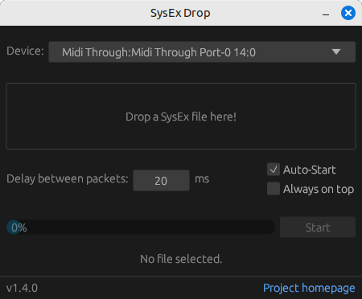

# SysEx Drop

## About

**SysEx Drop** is a cross-platform utility for sending SysEx files to MIDI devices via a simple drag-and-drop GUI.

## Usage

- Download and install the package for your platform from the [releases page](https://github.com/sourcebox/sysex-drop/releases/latest).
    - macOS: open the DMG file and drag the program symbol into the *Applications* folder on your disk.
    - Windows: open the MSI file to run the installer or run the EXE file directly without installation
    - Linux: open the AppImage to run the application without installation or use the DEB file to install it (Debian-based distributions only).
- Launch the application. Depending on the platform, there may be security warnings about being from an untrusted developer or source. You have to accept these warnings or [build the application from source](BUILDING.md) yourself. This is a common issue for open source applications because they are not signed by their developers at the OS manufacturers.
- Drop a file onto the application window. If the file contains valid SysEx data, some information about its content is displayed. In case of invalid file content, an error message is shown in the lower part of the window.
- Press the *Start* button. The SysEx data from the file is sent now to the device. The progress bar will show how much data has already been transferred.
- Transfers can be aborted using the *Cancel* button while in progress. This is mainly useful for large transfers that take a longer time and fail on the device side.
- A status message is shown after the transfer is completed or cancelled.

### Adjusting the transfer delay setting

You can adjust the transfer delay between the individual SysEx packets. The setting offers a range from 1 to 500ms with a default of 20ms.

Which settings work is dependent on the receiving device but also the MIDI interface involved. Devices that are directly connected to the computer via USB MIDI can take advantage of the higher transfer rate USB offers.

In short:
- Most devices work properly with the default value.
- If the receiving device does not recognize the data correctly, try to increase the delay setting.
- If you have a large transfer to a device that can process it fast enough, you can try to lower the setting. There is no general rule how low it can be set. You have to find out the limits of reliable operation yourself.

## Building from Source

See [separate document](BUILDING.md) for detailed instructions.

## License

Published under the MIT license. All contributions to this project must be provided under the same license conditions.

Author: Oliver Rockstedt <info@sourcebox.de>

## Donations

If you like to support my work, you can [buy me a coffee.](https://www.buymeacoffee.com/sourcebox)

